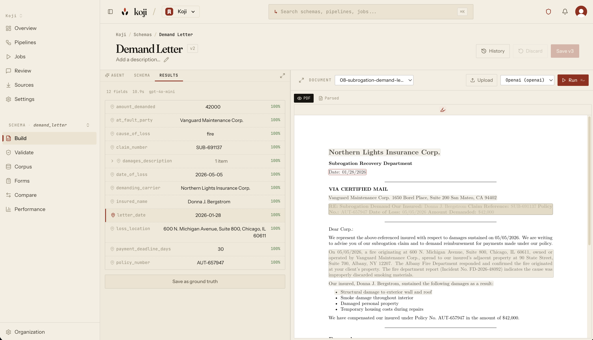

<p align="center">
  
</p>

<h1 align="center">Koji</h1>

<p align="center">
  <strong>Documents in. Structured data out.</strong><br />
  Open source document processing platform — parse, classify, and extract structured data from any document.
</p>

<p align="center">
  <a href="https://github.com/getkoji/koji/stargazers"></a>
  <a href="LICENSE"></a>
  <a href="https://console.getkoji.dev"></a>
</p>

<p align="center">
  <a href="https://console.getkoji.dev">Try it now (no install)</a> &middot;
  <a href="#quick-start">Self-host</a> &middot;
  <a href="https://docs.getkoji.dev/integration/">API Docs</a> &middot;
  <a href="https://docs.getkoji.dev/schema-guide/">Schema Guide</a>
</p>

---

<!-- TODO: Replace with a real screenshot/GIF of the build tool showing
     a PDF with bbox highlights on the left, extracted JSON on the right.
     This is the single most important element on the page. -->

<p align="center">
  
</p>

---

**96.2% extraction accuracy** across 11 document types. A 252-page scanned insurance policy parses and extracts in 15 seconds.

Most document AI tools dump your entire file into an LLM and hope for the best. Koji uses an intelligent pipeline — it maps document structure, routes each field to the relevant sections, extracts in parallel, retries on misses, and scores confidence. The result: fewer tokens, faster extraction, higher accuracy.

| | Koji | AWS Textract | Azure Doc Intelligence | Raw GPT-4 |
|---|---|---|---|---|
| **Self-hosted** | Yes (Apache 2.0) | No | No | No |
| **Custom schemas** | YAML — any field, any doc type | Predefined models only | Predefined + custom training | Prompt engineering |
| **Scanned PDFs** | Full OCR + intelligent chunking | Yes | Yes | No native OCR |
| **Confidence scoring** | Per-field provenance + validation | Per-word confidence | Per-field confidence | None |
| **100+ page docs** | Parallel chunking, no timeout | Page limits | Page limits | Context window limits |
| **Cost** | Your LLM API key | $1.50/page | $0.01-0.10/page | ~$0.02/page (input tokens) |

## Quick Start

**Option 1: Koji Cloud (fastest way to try it)**

1. Sign up at [console.getkoji.dev](https://console.getkoji.dev)
2. Add your LLM API key in **Settings → Model Catalog** (OpenAI, Anthropic, or any OpenAI-compatible provider)
3. Create a schema, upload a document, and see extraction results with source highlighting

**Option 2: Self-host**

```bash
# Install the CLI
uv tool install git+https://github.com/getkoji/koji.git

# Scaffold a project
koji init myproject && cd myproject

# Set your LLM key (or use ollama for fully local)
export OPENAI_API_KEY=sk-...

# Start the cluster
koji start
```

Dashboard at [localhost:9400](http://localhost:9400). API at [localhost:9401](http://localhost:9401).

## Process Your First Document

Define what you want to extract:

```yaml
# schemas/invoice.yaml
kind: schema
name: invoice
fields:
  vendor:
    type: string
    required: true
  invoice_number:
    type: string
  date:
    type: date
  total:
    type: number
    required: true
  items:
    type: array
    items:
      type: object
      properties:
        description: { type: string }
        quantity: { type: number }
        amount: { type: number }
```

Run it:

```bash
koji process ./invoice.pdf --schema ./schemas/invoice.yaml
```

```json
{
  "vendor": "Acme Corp",
  "invoice_number": "INV-2026-0042",
  "date": "2026-03-15",
  "total": 4250.00,
  "items": [
    { "description": "Widget A", "quantity": 100, "amount": 2500.00 },
    { "description": "Widget B", "quantity": 50, "amount": 1750.00 }
  ]
}
```

Push schemas to the cloud or use the HTTP API:

```bash
koji push                    # Push schemas to Koji Cloud
koji login                   # Authenticate with your account
```

## How It Works

Koji's extraction pipeline is smarter than "send everything to an LLM":

```
Document (PDF, image, DOCX, scan)
    |
    v
1. PARSE ---- OCR + layout detection (Docling, EasyOCR)
    |          Scanned? Full-page OCR. Digital? Fast text extraction.
    |          Large doc? Parallel chunking across GPU containers.
    v
2. MAP ------- Split at headings, classify sections, detect signals
    |          (tables, dates, dollar amounts, key-value pairs)
    v
3. ROUTE ----- Score each field against each chunk using schema hints
    |          Group co-located fields to minimize LLM calls
    v
4. EXTRACT --- Parallel LLM calls per group (not one giant prompt)
    |          Wave-based field dependencies for conditional logic
    v
5. RECONCILE - Merge results, deduplicate arrays, confidence scoring
    |          Per-field provenance: where in the document was this found?
    v
6. VALIDATE -- Type checking, enum matching, format normalization
    |          Gap-fill retries for missing required fields
    v
Structured JSON + confidence scores + source highlighting
```

A 232-page insurance policy: **2 LLM calls, 2.7 seconds, gpt-4o-mini.**

## Schema Hints

Hints tell the router where to look — no hardcoded domain knowledge in the engine:

```yaml
fields:
  policy_number:
    type: string
    required: true
    hints:
      look_in: [declarations]        # Only search "declarations" sections
      patterns: ["policy.*number"]   # Regex boost for matching chunks
      signals: [has_policy_numbers]  # Boost chunks with policy-number-like strings

  effective_date:
    type: date
    depends_on: [form_type]          # Extract after form_type is known
    extraction_hint_by:              # Conditional extraction instructions
      form_type:
        "10-K": "Look for the fiscal year end date"
        "10-Q": "Look for the quarterly period end date"
```

## Model Providers

BYO model — local or API. No vendor lock-in.

| Provider | Example | Notes |
|----------|---------|-------|
| OpenAI | `openai/gpt-4o-mini` | Set `OPENAI_API_KEY` |
| Anthropic | `anthropic/claude-sonnet-4-20250514` | Set `ANTHROPIC_API_KEY` |
| Ollama | `llama3.2` | Fully local, runs in the cluster |
| Any OpenAI-compatible | `custom/model-name` | Set `KOJI_OPENAI_URL` |

## CLI

| Command | Description |
|---------|-------------|
| `koji init [dir]` | Scaffold a project (`--template invoice`, `--list-templates`) |
| `koji start` / `stop` | Start or stop the processing cluster |
| `koji process <path>` | Parse + extract a document |
| `koji extract <md>` | Extract from pre-parsed markdown |
| `koji push` / `pull` | Sync schemas and pipelines with Koji Cloud |
| `koji validate <schema>` | Backtest a schema candidate against its corpus ground truth (doesn't go live) |
| `koji schema versions / promote / release` | List versions; promote a candidate to a live release |
| `koji classify run <classifier> <doc>` | Classify one document; show label, confidence, method, tier |
| `koji classify versions / promote / release` | List classifier versions; promote a candidate to a live release |
| `koji pipeline ls / deploy` | List pipelines; pin one to a schema version or set it back to auto |
| `koji pipeline run <pipeline> <doc…>` | Run documents through a pipeline (the dashboard's manual run); `--no-wait` to submit async |
| `koji pipeline result <jobSlug>` | Fetch a submitted pipeline job's documents + extraction |
| `koji pipeline test <pipeline> <doc>` | Dry-run a doc through a pipeline; show the routing decision (which classify label + branch + schema) without persisting |
| `koji pipeline bench <pipeline> --corpus <path>` | Run a whole corpus through a pipeline and score routing (correct schema?) + extraction (per terminal schema), without persisting |
| `koji run <schema> <doc>` | Extract one corpus document (the Build tab's Run) |
| `koji corpus ls / diff / add / tag / gt` | Manage a schema's validation corpus |
| `koji review stats / ls / show / promote` | Triage the review queue (true counts via `stats`) and promote reviewed docs into the corpus |
| `koji bench` | Benchmark accuracy against a local validation corpus |
| `koji test` | Run extraction regression tests |
| `koji doctor` | Check environment health |

## Documentation

- **[Integration Guide](https://docs.getkoji.dev/integration/)** — HTTP API, presigned uploads, programmatic usage
- **[Schema Guide](https://docs.getkoji.dev/schema-guide/)** — Fields, types, hints, arrays, dependencies
- **[API Reference](https://docs.getkoji.dev/api-reference/)** — Complete endpoint reference
- **[Configuration](https://docs.getkoji.dev/configuration/)** — koji.yaml, environment variables, model setup

## Contributing

Contributions welcome. See [CONTRIBUTING.md](CONTRIBUTING.md) for guidelines.

## License

[Apache 2.0](LICENSE) — use it commercially, modify it, self-host it. No strings.
